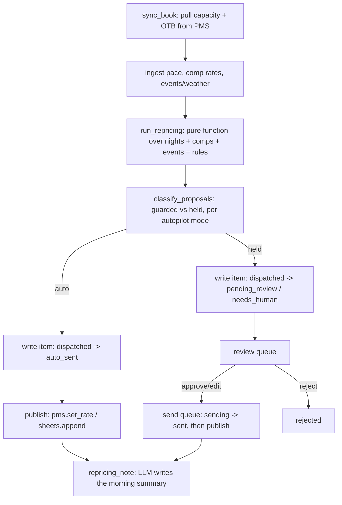

# Revenue Management AI — "The Quant"

Runs your pricing the way the big-league revenue systems do — continuously, not once a day.

## What it does

Runs your pricing the way the big-league revenue systems do — continuously, not once a day. It rebuilds the demand picture on every new booking and on a twice-hourly schedule, reading pickup pace against last year, competitor rate shops, local events and forward search demand, then searches thousands of candidate prices per run for the top of each night's revenue curve. On autopilot it publishes the moves straight to the PMS and booking channels inside guardrails you set — rate floor, max daily move, distance from the comp set — and holds anything unusual (deep cuts, stay-rule changes, near-term nights) for your approval. It also manages the stay rules that protect big nights: minimum length of stay (MLOS) on peaks so one-night bookings don't block a three-night guest, and gap-night overrides so awkward single-night holes still sell. Every price carries its 'why' — the exact contributions that moved it. Prefer hands-on? Advise mode proposes everything and publishes nothing; Simple mode runs the whole hotel off four numbers.

## What it won't do

Never breaches your rate floor, ceiling or max daily move — in full autopilot too. Weather never sets a price (it informs the demand forecast only), and whole-property rentals are left alone.

## Why it matters

Demand changes hour by hour; manual pricing doesn't. A human revenue manager reprices once a day at best, and most small hotels reprice once a season. This applies airline-style pricing discipline around the clock without adding headcount.

## What to expect

Continuous rate and stay-rule updates across all future nights, published to the PMS inside your guardrails — recovering the 2–6% of RevPAR typically lost to under-priced peak nights, over-priced slow nights, and empty gap nights.

The roster text above is quoted exactly as it appears on the demo platform's
agent menu — this repo does not promise more than that, and does not
promise less. ROI figure: `+4%` RevPAR.

## Who it's for

Independent hotels and small groups that reprice by feel, on a spreadsheet,
or once a week at best — and want the discipline a big chain's revenue
system runs, without hiring a revenue manager. It replaces the "check three
competitor sites, glance at pace, nudge a few rates" part of that job, not
the person who sets strategy.

You will get the most from this repo if:

- You have a PMS or at least a CSV export of your reservations and room
  types.
- You already watch competitor rates, local events, or pickup pace by hand
  — this agent automates exactly that, it does not invent a strategy from
  nothing.
- You are comfortable reviewing AI-proposed rate moves before they publish,
  at least at first — this ships in shadow mode and stays there until you
  say otherwise.
- You want stay-rule discipline (minimum-stay on peak nights, gap-night
  fills) as much as you want rate changes — most spreadsheet pricing skips
  this entirely.

It is less of a fit if you sell almost everything through a single wholesale
contract with no flexible retail rate to move, or if you have no PMS and no
plan to keep even a CSV export current — this agent needs somewhere to read
your live book and somewhere to publish an approved rate.

## How it works

One deterministic pricing engine plus two folded-in sub-agents that read the
same tables — no randomness, no model call anywhere near a number.



`tools/pricing_engine.py` is the whole decision engine and has no I/O in it:
plain dataclasses in, a list of proposals and a step-by-step thinking log
out. `tools/run.py` is the only place that talks to the PMS, the store and
the LLM. The **only** model call in this agent's main loop writes a short
morning note about a run that already finished (`prompts/repricing_note.md`)
— it cannot move a price. Full detail, the exact house rate formula, and the
11 design decisions taken where the source this repo was built from left a
gap: `docs/how-it-works.md`.

### The two modes

| Mode | What happens |
|---|---|
| `shadow` (default) | Reads, thinks, drafts every proposal, and queues. **Never** publishes a rate or a stay rule — including an item you already approved; the approval is recorded, publishing waits for `mode: live`. |
| `live` | Items that are approved — by you, or by autopilot inside every guardrail — actually publish. Everything else still waits. |

### The review loop

Nothing publishes without a person, or a guardrail, saying so.
`workflows/80-review.md` covers the full loop: list, show, approve, edit,
reject, publish.

### What runs when

| Workflow | Cadence | Provider used |
|---|---|---|
| `workflows/10-repricing.md` (`tools/run.py`) | twice hourly, or `make watch` | whatever `llm.provider` is set to (narration only) |
| `workflows/21-demand-forecast.md`, off by default | daily | narration only |
| `workflows/22-ota-parity.md`, off by default | every 4 hours | none — no LLM call anywhere on this path |
| `workflows/80-review.md` (`tools/review.py`) | whenever a human is available | none — queue operations only |

`python3 tools/schedule.py --all` prints one ready-to-paste cron/launchd/
systemd snippet per entry above, read straight from `config/agent.yaml:
schedule:` — see "Run it" below.

## What you need

| Item | Required? | Notes |
|---|---|---|
| A computer or small server that can run Python 3.11+ | Yes | Your laptop is fine to start; `workflows/90-go-live.md` covers scheduling it properly. |
| A Claude Code subscription, or your own Anthropic API key | Yes | The `interactive` provider uses the Claude Code session you already have open — zero extra cost, and the model only ever writes a morning note. |
| A PMS, or at least a CSV export of your reservations and room types | Yes | Starts on `mock` fixtures; the `csv` adapter works with any PMS. |
| A way to export pickup pace, competitor rates, or local events, even by hand | Recommended | No PMS or adapter exposes these — see "Connect your systems" below. Starts neutral (pace 0, comp median 1.0) with no data at all. |
| A Google Sheet, or nothing at all | Optional | Stay-rule changes export to local CSV by default; a Sheet is a nicer place for a human to read them. |

Time estimate: 15 minutes to see the demo, half a day to connect a real PMS
and fill in your property's room types and guardrails, a few days of
watching the review queue before you would reasonably consider going live.

## Quick start (5 minutes, no credentials)

```bash
git clone https://github.com/th1-ai/revenue-management-ai.git revenue-management-ai
cd revenue-management-ai
make setup
make demo
```

You should see something like this (shortened):

```
Revenue Management AI demo - Hotel Aurora, fixtures/hotel + fixtures/inbound

Repricing (tools/run.py):

Note: mock

  - Read the live book - 21 nights x 4 room types (84 price cells). 611 of 882 rooms on the books (69% of capacity). Tonight: 64.3% occupied.
  - Pickup pace vs last year - 9 night(s) pacing more than 3 pts ahead, 4 pacing behind. Divergent days get repriced; the rest are left alone.
  - Competitor scan - comp-set median 1.12x tonight, 1.0x on the busiest night.
  - Event radar - 2 event(s) in the window: Riverfront Tech Summit, Quiet midweek window
  - Gap nights - 2 found.
  - Stay rules (MLOS) - 5 change(s) proposed.
  - Draft rate proposals - 68 across 17 night(s).
  - Searched the price space - tested 2604 candidate prices (84 cells x 31 price points, +/-30% around formula) against each night's demand curve.
  - Guardrail check - 16 proposal(s) clamped by the daily cap, 0 cut(s) held at the floor.
  - Decision - 68 move(s) across 17 night(s) (incl. 8 gap-night fill(s), 5 stay-rule change(s), 2 offer(s)) - projected +2136 EUR on rooms still to sell.

Demand Forecasting AI - The Oracle (tools/run.py --forecast):
  ...

OTA Content & Parity AI - The Cartographer (tools/run.py --parity):
  ...

81 item(s) waiting for a person (deep cuts, stay-rule changes and near-term nights always do - see docs/safety.md).
Nothing was published: mode is shadow, and demo never calls set_rate() or sheets.append() on anything but the fixtures.
Next: `make review` to see what is waiting, or read workflows/10-repricing.md.

DEMO OK — 75 items processed, 75 drafted, 0 sent (shadow)
```

Every number above comes from an invented hotel, "Hotel Aurora," with 21
nights of fabricated bookings, a fabricated congress, and fabricated
competitor rates — designed to exercise a gap night, a slow week, a comp-set
undercut, and both sub-agents in one run, so you can see exactly how this
agent thinks before it ever touches your real book. `make demo` force-runs
both sub-agents for this walkthrough only; in a real run they stay off until
you turn them on. Next: open `claude` in this folder and follow "Set up with
Claude Code" below.

Then `make doctor` — expect one `FAIL` (`hotel identity`, because the
property is still the shipped placeholder "Hotel Aurora") and a couple of
`warn` lines. That is the intended state of a fresh clone; see
`workflows/00-setup.md` for filling in the real property.

## Set up with Claude Code

Open `claude` in this folder. Paste each prompt below in order — Claude will
follow the named workflow file, which tells it exactly which tools to run
and what to check.

**Phase 1 — first run.**

> Read `workflows/00-setup.md` and walk me through it. I have not run this
> agent before.

**Phase 2 — the repricing loop.**

> Read `workflows/10-repricing.md`. Run one pass and show me what Revenue
> Management AI did with each proposal in plain language.

**Phase 3 — the review queue.**

> Read `workflows/80-review.md`. Show me what is waiting for me, one at a
> time, and act on my decisions.

**Phase 4 — the two sub-agents (only if you need them).**

> Read `workflows/21-demand-forecast.md` (a demand outlook and rate-shopping
> panel) and/or `workflows/22-ota-parity.md` (OTA rate-parity and
> content-health checks), and help me turn on whichever one applies to us.

**Phase 5 — going live.**

> Read `workflows/90-go-live.md`. Go through the checklist with me honestly
> — do not recommend going live until it is genuinely true.

You can also just run the agent directly — `/revenue-management-ai` in this
folder runs the main loop and works the queue in one command; see
`.claude/skills/revenue-management-ai/SKILL.md`.

## Connect your systems

Full detail, including the "implement your own" recipe, is in
`docs/integrations.md`. This agent uses only two of the four shared
adapters — **PMS** and **Sheets** — plus five CSV-based signal inputs no
adapter family in this repo family covers at all.

### PMS - `systems.pms.adapter` in `config/hotel.yaml`

| Adapter | Status | Needs |
|---|---|---|
| `mock` | universal | nothing — reads `fixtures/hotel/*.json` |
| `csv` | universal | a CSV export in `data/imports/` — works with any PMS |
| `cloudbeds` | built | `CLOUDBEDS_CLIENT_ID`, `CLOUDBEDS_CLIENT_SECRET`, `CLOUDBEDS_REFRESH_TOKEN`, `CLOUDBEDS_PROPERTY_ID` |
| `cli` | universal | `PMS_CLI_COMMAND`, `PMS_CLI_PROFILE` — a JSON-speaking vendor CLI |

Reads room type capacity and on-the-books reservations every sync
(`tools/sync_book.py`), the only step that touches the PMS. Writes an
approved rate via `pms.set_rate()`. There is no `set_min_los()` on the
shared PMS interface — see "Signals this agent needs" below for how a
stay-rule change actually publishes.

### Signals this agent needs, with no adapter

Pickup pace, competitor rates, local events/weather, and (for the
Cartographer) OTA-observed rates and content findings are not something any
PMS, email, messaging or sheets API exposes. `tools/ingest.py` reads them
from `data/imports/*.csv` — the same universal pattern as the PMS `csv`
adapter, just without inventing a new adapter class — falling back to
`fixtures/inbound/*.json` for the demo.

| File | Columns | Feeds |
|---|---|---|
| `data/imports/pace.csv` | `date, room_type_id, pace_vs_ly_pts` | pickup pace vs last year — defaults to `0` with no data |
| `data/imports/comp_rates.csv` | `date, competitor, rate_multiplier, room_type_id, note` | comp-set median, rate-shopping panel |
| `data/imports/events.csv` | `name, kind, category, start_date, end_date, note` | event radar, MLOS, the forecast's weather signal |
| `data/imports/ota_rates.csv` | `channel, date, room_type_id, observed_rate` | the Cartographer's parity check |
| `data/imports/ota_content_findings.csv` | `channel, kind, detail, severity` | the Cartographer's content-health score |

`make doctor`'s "signal sources" line shows which file each one is actually
reading from, or whether it is defaulting to neutral/empty.

### Sheets - `systems.sheets.adapter`

| Adapter | Status | Needs |
|---|---|---|
| `csv` | universal | nothing — writes `data/exports/*.csv` |
| `google` | built | `GOOGLE_SHEET_ID`, `GOOGLE_SERVICE_ACCOUNT_FILE` |

Publishes an approved stay-rule (MLOS) change: `sheets.append("mlos_changes",
…)`. There is no shared PMS write for a minimum-stay restriction — every PMS
models it differently — so an approved change lands here for you to apply in
your PMS's rate-plan screen, or you wire up your own write once you know
your vendor's shape — the recipe is in `docs/integrations.md`, "Implement
your own."

### Everything else

Email and messaging adapters exist in `core/adapters/` (every repo in this
family ships all four) but **this agent uses neither** — it has no guest
inbox and sends no messages, so `make doctor` shows `ok` rows for them
without them mattering here. `pos`, `accounting`, `reviews`, `calendar`,
`payments`, `procurement` and `locks` are unused stubs, same as every repo
in this family.

Check what is actually working on your machine at any time:

```bash
make doctor
```

## Run it

```bash
make run                             # sync + reprice + classify + publish/queue
make run ARGS="--dry-run"            # compute everything, publish nothing
make run ARGS="--as-of 2026-09-01"   # rehearse against a specific date
make watch                           # keep the repricing loop running on schedule
python3 tools/run.py --once --forecast   # Demand Forecasting AI, once enabled
python3 tools/run.py --once --parity     # OTA Content & Parity AI, once enabled
```

**Scheduling.** Every recurring job lives in `config/agent.yaml: schedule:`
with its own `command:` and `cadence:` — `repricing` (twice hourly),
`demand_forecast` (daily), `ota_parity` (every 4 hours):

```bash
python3 tools/schedule.py --all
```

prints one ready-to-paste cron/launchd/systemd snippet per job, read
straight from that block. `scheduler/crontab.example`,
`scheduler/launchd.example.plist`, `scheduler/systemd.example.service` and
`scheduler/systemd.example.timer` have the generic single-job form if you
would rather hand-edit.

**Subscription or API.** `llm.provider: interactive` or `claude-code` runs
on the Claude Code subscription you already pay for — genuinely the
cheapest way to run a small hotel's agent, with the caveat that Anthropic's
usage policy governs automated use of a personal subscription (a handful of
scheduled runs a day is normal; hammering it around the clock is not).
`llm.provider: anthropic` uses your own API key, bills per token, and is the
right choice for production volume. Either way the model only ever writes a
morning note — `make report` shows what you are actually spending, and it
should stay small. See `docs/safety.md` for the full honest note.

## Go live

Shadow mode is the default and stays the default until you change it. The
full checklist — real room types and guardrails filled in, a real PMS
connected, a few days of real review behind you, the shadow backlog cleared
— is in `workflows/90-go-live.md`. In short:

```yaml
# config/hotel.yaml
mode: live
```

Going live means an **approved** item, or an auto-eligible one inside every
guardrail, now actually publishes — it does not change what needs approval.
`review.require_approval_for` still lists `pms_write` and `sheets_write` by
default, which means every proposal still waits for you even in `mode:
live`, until you deliberately remove `pms_write` from that list once you
trust guarded autopilot. Before flipping the switch, clear the backlog that
built up in shadow mode — it was computed against yesterday's book:

```bash
python3 tools/review.py stale
```

Going back to shadow (`mode: shadow`, or `AGENT_MODE=shadow` in `.env` for
one run) stops every publish immediately, mid-schedule, with no other change
required.

## Guardrails & safety

Full detail in `docs/safety.md`. The short version:

**What it will not do.**

- Publish anything while `mode: shadow` — including an item you already
  approved. The approval is recorded; publishing waits for `mode: live`.
- Publish a rate outside its room type's `floor`/`ceiling`, or move a rate
  more than `max_move_pct` in one day — in `advise`, `guarded`, **and**
  `full` autopilot.
- Auto-publish a stay-rule (MLOS) change, in any autopilot mode. It always
  waits for a human.
- Let weather set a price. `run_repricing()` only ever reads event rows;
  weather rows are read exclusively by the (optional) forecast.
- Take a payment, issue a refund, or move money — payment adapters are
  read-only by design and this agent never calls one.

**What always escalates**, whatever autopilot decides
(`config/agent.yaml`, enforced in `tools/pricing_engine.py`'s
`classify_proposals`):

- A stay-rule change — always.
- A cut deeper than `hold_cut_pct` (default −8%).
- Anything inside the near-term manual window (`near_manual_days`, default 3
  nights) — that close in, it is the duty manager's call.
- A proposed rate outside `comp_distance_pct` (default ±15%) of the comp-set
  median.

**No guest-facing text, so no AI-disclosure line.** Unlike a guest-messaging
agent, this repo produces nothing a guest ever reads — a price is not a
message. The EU AI Act Article 50 guest-disclosure pattern the rest of this
family follows does not apply here; there is no signature line to add. See
`docs/safety.md`.

**Data handling.** Everything lives in `data/agent.db` on your own machine —
there is no cloud service behind this repo. `nights`/the review queue hold
aggregate counts (rooms on the books) per date and room type, not guest
identity.

## Sub-agents in this repo

Both fold into this repo and are **off by default** — the repricing loop
above is fully useful without either. Full detail: `docs/sub-agents.md`.

### Demand Forecasting AI — "The Oracle"

**Does.** Watches what nearby hotels are charging (the industry calls this rate shopping), plus local events, weather, and search/pace data, and forecasts demand — feeding the Revenue Management AI so pricing is market-aware, not just rule-based. Every forecast shows its working: each signal's contribution night by night, and the engine's own tracked error rate.

**Won't.** Doesn't set prices itself; it advises the Quant.

Off by default — see `workflows/21-demand-forecast.md` to turn it on. Its
forecast does **not** feed the repricing engine in this template, on
purpose — `docs/how-it-works.md` "Design decisions" #10 explains why.

### OTA Content & Parity AI — "The Cartographer"

**Does.** Watches every OTA listing (Booking.com, Expedia, Airbnb…) around the clock for the two things that quietly kill visibility: rate parity breaks (a channel showing a cheaper price than your own site, which OTAs punish with lower ranking) and content gaps (missing photos, thin descriptions, wrong amenities, inconsistencies between channels). Flags every break, drafts the fix, and resyncs the channel on approval.

**Won't.** Doesn't set rates (the Quant's job) and doesn't create marketing content (the Marketing & Social AI's job) — it distributes and polices what they produce.

Off by default — see `workflows/22-ota-parity.md` to turn it on. No LLM
anywhere on this path; every fix is a template function quoting the
finding's own numbers.

## Customising

**`config/agent.yaml`.** Your real room types (`base_rate`/`floor`/
`ceiling` per type — the engine will not price a type it does not know
guardrails for), `season_multiplier`, every guardrail (`max_move_pct`,
`hold_cut_pct`, `near_manual_days`, `comp_distance_pct`, …), `autopilot`
mode, `engine: full | simple`, the `subagents` block, `schedule:`.

**`knowledge/pricing-policy.md`.** Not read by any prompt — a plain-language
record of why your guardrails are set where they are, for the next person
who inherits this account. See `knowledge/README.md`.

**`prompts/`.** `prompts/repricing_note.md` and `prompts/forecast_note.md`
are plain markdown with `{{var}}` placeholders — edit them to change the
morning note's tone. They cannot change a number; only the words about one
that already happened.

**Adding a language.** There is nothing to add — this agent produces no
guest-facing or staff-facing free text beyond the (optional) morning note,
which is always written in the language you write the prompt in.

**Simple mode.** `config/agent.yaml: engine: simple` switches the whole
property to a four-input counter-offer (base price, min, max, target
occupancy, plus an aggressiveness dial) instead of the full engine — see
`docs/how-it-works.md` "Simple mode." Every proposal still goes through the
same review queue and the same floor/ceiling. `simple.reference_room_type`
must name one of your own `room_types` ids — it is the one room the whole
counter-offer is priced off. `make doctor`'s "simple engine" line checks
this and names the valid options if it is stale; `make run` fails the same
readable way, never a traceback.

## Troubleshooting & FAQ

Full list in `workflows/99-troubleshooting.md`. The most common ones:

**`make doctor` shows a FAIL.** Every line has a fix hint right under it —
read it before doing anything else. The "hotel identity" FAIL on a fresh
clone is expected.

**`make run` exits with code 3.** Not an error — `llm.provider: interactive`
is waiting for you to answer the parked morning-note prompt in
`data/pending/`. (`python3 tools/run.py --once` itself really does exit 3 —
`make run` prints `make: *** [run] Error 3` in the console, naming the real
code, but Make's own exit status is always 2 for any failed recipe, GNU
Make's own convention, regardless of what the command underneath exited
with. Script against `python3 tools/run.py --once` directly if you need the
real number, not `make run`.) Every pricing decision was already made and
queued before this happened.

**A proposal never appears in the queue.** Proposals are keyed per calendar
day — re-running the same day for a cell that already has a decision
changes nothing; see `docs/how-it-works.md` "Idempotency." A move smaller
than `min_move_eur` is discarded as noise before it becomes a proposal at
all.

**The comp-set median always shows 1.0, or pace always shows 0.** The
honest default with no data — see `docs/integrations.md` for the CSV files
that feed these.

**Can I run this without a PMS at all?** No — unlike some agents in this
family, room capacity and on-the-books figures come only from
`systems.pms.adapter`. `mock` or `csv` both work with no live connection.

## Measuring the benefit

`make report` shows volumes, the auto-published rate, rejections, and LLM
spend — all computed from `data/agent.db`, nothing phoned home. See
`docs/benefits.md` for what each number means, why "published
automatically" means something different in shadow mode than in live mode,
and the honest caveats before you quote any of this to someone else.

```bash
make report
python3 tools/report.py --json
```

## About

Built by [TH1](https://th1.ai) — we build and run AI agents for
independent hotels. This repo is free to use, modify and self-host under
the MIT licence (see `LICENSE`).

Want it run for you, tuned to your property, with someone accountable for
the result? [Talk to TH1](https://th1.ai).

**Changelog**

- v1.0 — initial release: the repricing loop (rate moves, gap nights,
  stay-rule changes, length-of-stay offers), Demand Forecasting AI and OTA
  Content & Parity AI folded in, both off by default.
