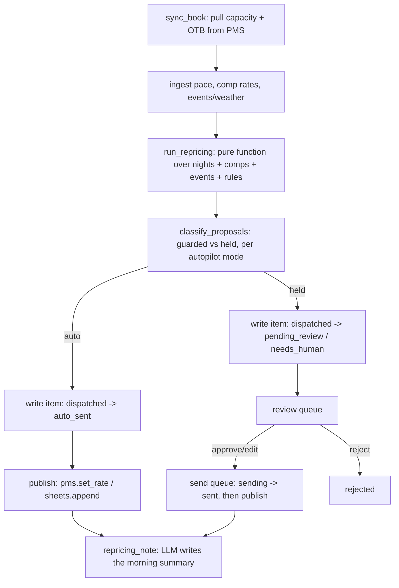

# How Revenue Management AI works

One deterministic pricing engine plus two folded-in sub-agents that read the
same tables. Nothing in this file is invented technology: every piece maps to
a `tools/*.py` module you can read end to end. The engine that sets prices is
**pure functions over plain data — no network call, no model call, no
randomness.** The only place a model is ever used is to write a short prose
summary of a run that already happened; it never sees a number before that
number is final.

## The main loop (`tools/run.py`, `tools/pricing_engine.py`)

**Step 1 — sync the book.** `tools/sync_book.py` reads `core.adapters.get_pms()`
for room type capacity and on-the-books reservations over the next
`horizon_nights` (21 by default), and upserts one row per (date, room type)
into this repo's own `nights` table. This is the only step that touches the
PMS.

**Step 2 — ingest the signals nobody's PMS exposes.** Pickup pace against
last year, competitor rate shops, local events/weather, and (for the
Cartographer) OTA-observed rates and content findings are not things a
property management system's API gives you — see "Design decisions" #1.
`tools/ingest.py` reads them from `data/imports/*.csv` (a hotel's own export,
or a script you point at a rate-shopping tool) or, for `make demo`, from
`fixtures/inbound/*.json`.

**Step 3 — reprice.** `tools/pricing_engine.py:run_repricing()` is a pure
function: give it the `nights`, `comp_rates` and `events` rows plus the rules
toggles, get back a list of `Proposal` objects and a step-by-step thinking
log, in the same shape whether the caller is `tools/run.py`, `tools/demo.py`
or a test. See "The repricing steps" below for exactly what it does.

**Step 4 — classify.** `classify_proposals()` decides, per proposal, whether
the configured autopilot mode (`advise` / `guarded` / `full`) publishes it
immediately or holds it for a human — the guardrail order is fixed, so the
hold reason you see is always the *first* one that fired, never a vague
"held."

**Step 5 — write and publish.** Every proposal becomes one row in
`core.store`'s universal `items` table (`kind: rate_move`, `mlos_change`,
`offer`, `ota_parity`, `ota_content`). An `auto: true` proposal is written
straight to `dispatched -> auto_sent` and published in the same pass; a held
one goes to `pending_review` or `needs_human` and waits in
`workflows/80-review.md`'s queue. Publishing itself always goes through
`core.review`'s write guard — shadow mode blocks it regardless of what
autopilot decided.

**Step 6 — narrate.** `tools/run.py` calls `core.llm.complete()` exactly
once per pass, with the finished, already-decided summary as its only input
(`prompts/repricing_note.md`). The model cannot move a price; it can only
describe one that has already moved. If the call fails for any reason, the
run has already succeeded — the note is a nice-to-have on top, never a
dependency.

## Publishing: which system, which write

| Proposal kind | Published via | Guarded action |
|---|---|---|
| `rate` / `gap_night` | `pms.set_rate(date, room_type, price)` | `pms_write` |
| `mlos` (stay-rule change) | `sheets.append("mlos_changes", …)` — see #7 below | `sheets_write` |
| `offer` (length-of-stay idea) | nothing — informational only, see step 7d | — |

## The repricing steps (`run_repricing`)

Ported from the behavioural spec this repo was built from, with the design
decisions in the next section applied. Ten visible steps, always in this
order, each producing one line of the thinking log a human can read:

1. **Read the live book.** Total rooms on the books across the horizon, and
   tonight's occupancy — deterministic arithmetic over `nights`.
2. **Pickup pace vs last year.** Counts nights pacing more than 3 points
   ahead or behind, from the ingested `pace_vs_ly_pts` column. Rule
   `pace_moves` gates this entirely.
3. **Competitor scan.** The comp-set median rate multiplier tonight and on
   the busiest night in the window, from ingested `comp_rates`. Rule
   `comp_guard`.
4. **Event radar.** Lists ingested events covering the window. Weather rows
   are read by the forecast only — never here (see "Guardrails" below).
5. **Gap nights.** A night is a gap when both neighbours are at or above
   `gap_neighbour_occ` and this night trails both by at least `gap_drop_pts`.
   Rule `gap_fill`.
6. **Stay rules (MLOS).** Sets a 2-night minimum on a peak night (an uplift
   event or a busy weekend), releases it back to 1 once demand fades. Rule
   `mlos_guard`. Date-level, not room-type-level — see #6.
7. **Draft proposals**, one per (date, room type) cell, in strict priority
   order: gap-night fill, then a slow-market deep cut, then the ordinary
   move (an additive stack of event / pace / comp-guard percentages), each
   clamped by the floor, the ceiling, and the ±`max_move_pct` daily cap, with
   moves under `min_move_eur` discarded as noise. Length-of-stay offers are
   drafted separately for the softest nights.
8. **Search the price space.** Presentation only — reports how many candidate
   prices were considered; see #5 in "Design decisions" for the honesty note
   this carries over from the source.
9. **Guardrail check.** How many proposals were clamped, and how many cuts
   were held at the floor.
10. **Decision.** One headline: how many moves, across how many nights,
    and the projected revenue impact (a deliberately conservative model —
    upside moves assume only half convert; downside moves are credited only
    the share of demand a cheaper price plausibly unlocks).

## Autopilot (`classify_proposals`)

The engine always proposes the same moves; the mode only decides which
publish themselves. In `guarded` (the default), the **first** guardrail below
that fires wins, so the hold reason shown to a human is always specific:

1. `near_manual` — inside the manual window (`near_manual_days`, default 3):
   "arrivals this close are the duty manager's call."
2. `hold_threshold` + `kind == mlos` — every stay-rule change is held, in
   every mode, including `full` — see #8.
3. `hold_threshold` + a cut deeper than `hold_cut_pct` (default −8%).
4. `comp_distance` — the proposed rate sits outside ±`comp_distance_pct`
   (default 15%) of the comp-set median.

Otherwise the proposal auto-publishes. `advise` mode never auto-publishes
anything; `full` publishes everything except stay-rule changes (rule 2 above
always applies).

## What runs when

| Workflow | Cadence | Provider used |
|---|---|---|
| `workflows/10-repricing.md` (`tools/run.py`) | twice hourly, or `make watch` | whatever `llm.provider` is set to (only for the note) |
| `workflows/21-demand-forecast.md` (`tools/forecast_engine.py`), off by default | daily | same, only for the note |
| `workflows/22-ota-parity.md` (`tools/parity_engine.py`), off by default | every few hours | none — no LLM call anywhere on this path, see #9 |
| `workflows/80-review.md` (`tools/review.py`) | whenever a human is available | none — queue operations only |
| `workflows/90-go-live.md` | once, then as needed | none |

No coach layer applies to this agent (see the brief) — there is no human-edit
loop to learn from, because there is no free-text draft to edit; a human
either approves a number or changes it, and a changed number is just a new
approved value, not a "lesson."

## Design decisions taken where the spec was open

The behavioural spec this repo was built from (`specs/revenue-management-ai.md`,
`specs/demand-forecasting-ai.md` and `specs/ota-content-parity-ai.md` in the
factory that built this template, if you have it) documents a real
demonstration system with several open questions and honest limitations.
Every one of the following is a deliberate decision, not an oversight:

1. **No adapter exists for a rate shopper, an events/weather feed, or an OTA
   extranet.** `core/adapters/` covers PMS, email, messaging and sheets —
   none of those is "competitor rates" or "local events." Rather than fake an
   integration, this repo ingests pickup pace, comp rates, events/weather and
   OTA-observed rates/content from `data/imports/*.csv` (your own export, or
   a script you point at a rate-shopping tool) with a `fixtures/inbound/`
   fallback for the demo. `docs/integrations.md` covers the exact columns.
2. **A rate ceiling was added.** The source system's `cant` promises "never
   breaches your rate floor, ceiling or max daily move," but its engine only
   ever implemented a floor and a daily-move cap — no ceiling constant
   existed. Since this repo makes that promise verbatim in the README, it
   also enforces `rate_ceiling` per room type, symmetric to the floor.
3. **The floor and ceiling are per room type, in your own currency, not one
   flat number.** The source used a single €280 floor that only ever bound
   its cheapest room type. `config/agent.example.yaml` asks for a floor and
   a ceiling per room type instead, because a hotel with a €95 room and a
   €420 suite cannot share one number honestly.
4. **Pickup pace is your own input, not a PMS read.** Almost no PMS exposes
   "rooms on the books at this same lead time, one year ago" through its
   API. Rather than pretend this is a live PMS field, `pace_vs_ly_pts` is
   ingested the same way as comp rates — from your own export, defaulting to
   `0` (neutral) for any cell you have not supplied. Wire up a real feed when
   you have one; the engine does not care where the number came from.
5. **"Searches thousands of candidate prices" is presentation, carried over
   honestly.** The price-response curve genuinely evaluates 31 candidate
   prices per night, but only *after* the guardrail stack has already picked
   the proposed rate — the curve's peak is then calibrated to land on that
   price, not the other way round. This repo keeps that mechanism (it is a
   legitimate way to *explain* a price) and says so plainly here rather than
   implying the search chose the number.
6. **MLOS is date-level, not per room type.** The source anchors its
   stay-rule logic on one room type's occupancy but writes the result to
   every room type on approval, which the spec itself flags as unresolved.
   This repo stores one `mlos` / `mlos_override` per date, full stop —
   simpler to reason about and to review.
7. **Stay-rule changes publish through Sheets, not the PMS.** There is no
   `set_mlos()` method on `core.adapters.base.PMS` — minimum-length-of-stay
   is a rate-plan restriction, and no common interface for it exists across
   PMSs the way `set_rate()` does. An approved MLOS change is written to
   `data/exports/mlos_changes.csv` (or a live Google Sheet) via
   `core.adapters.get_sheets()`, guarded exactly like any other write, so you
   apply it in your PMS's rate-plan screen yourself, or wire up your own
   `pms.update_reservation`-style patch once you know your vendor's shape.
8. **`full` autopilot still holds every stay-rule change.** The source's
   `full` mode published MLOS changes and steep gap-night cuts without
   review — flagged in the spec as a real gap. This repo always holds MLOS
   changes, in every mode; only rate moves and gap-night fills can ever
   auto-publish.
9. **The Cartographer never calls a model, on purpose.** Every fix draft is a
   template function reading the finding's own fields — verified against the
   spec, which is explicit that no LLM exists anywhere on that surface. This
   repo keeps it that way: `tools/parity_engine.py` has no prompt, no schema,
   and never imports `core.llm`.
10. **The forecast does not feed the pricer, and that is stated plainly.**
    The roster's `does` says the Oracle's forecast feeds the Quant "so
    pricing is market-aware." In the source system this was narrative only —
    `runForecast` and `runRepricing` are independent functions reading the
    same tables. This repo keeps them independent rather than quietly wiring
    one into the other (a real integration would need to decide how a
    21-night occupancy projection turns into a pace adjustment, which is a
    product decision for you to make, not one to default silently). The
    forecast is genuinely useful on its own — a demand outlook and a
    rate-shop panel — it just is not yet an input to `run_repricing()`.
11. **OTA parity is computed, not asserted.** The source's `ota_listings`
    status was a seeded label; nothing compared a real fetched rate against
    the direct rate. This repo computes it: an OTA-observed rate more than
    `parity_tolerance_pct` below the direct rate is a violation, full stop —
    see `docs/sub-agents.md`.

## Idempotency

- **Nights** are upserted by `(date, room_type_id)` — a re-sync refreshes
  capacity and OTB, never creates a duplicate row.
- **Proposals** are keyed `(kind, "{run_date}:{date}:{room_type_id}")` (MLOS
  and offers drop the room type). Re-running the optimizer again the same
  calendar day for a cell that already has an open or resolved-today
  decision changes nothing — you clear the queue first, or wait for
  tomorrow's run, which gets a fresh key. `store.mark_stale()` ages out
  anything left un-reviewed for 72 hours so the queue cannot silently grow
  forever.
- **Sends are claimed atomically.** `store.claim_for_send()` flips
  `approved`/`edited` to `sending` in one conditional `UPDATE`, so two
  runners racing on the queue can never both publish the same proposal —
  the same guarantee every repo in this family gets from `core.store`.
- **`--dry-run` never advances state.** Nothing is written to `nights`,
  `items`, or an external system while `--dry-run` is set, even in live
  mode.
- **OTA findings** are keyed `(kind, "{scan_date}:{channel}:{finding_kind}:{detail_hash}")`
  so re-scanning an already-open finding does not duplicate it, and a
  fixed-then-regressed issue on a later day gets a fresh row rather than
  silently reusing a closed one.

## Sub-agents in this repo

Both are off by default — the Quant's repricing loop is fully useful without
either. `docs/sub-agents.md` has the full detail; `workflows/21-demand-forecast.md`
and `workflows/22-ota-parity.md` cover turning them on.

- **Demand Forecasting AI ("The Oracle").** `tools/forecast_engine.py` — a
  21-night occupancy outlook plus a rate-shopping panel, reading the same
  `nights`/`comp_rates`/`events` tables. Independent of repricing (#10
  above).
- **OTA Content & Parity AI ("The Cartographer").** `tools/parity_engine.py`
  — rate-parity checks against your own ingested OTA rates, plus a
  content-health score per channel with templated fix drafts. No LLM
  anywhere on this path (#9 above).

## Where core stops and this agent starts

`core/` is byte-identical to `factory/core/`. Everything in `tools/`,
`prompts/`, `fixtures/`, `workflows/`, `config/agent.example.yaml` and
`knowledge/pricing-policy.example.md` is this agent's own.
